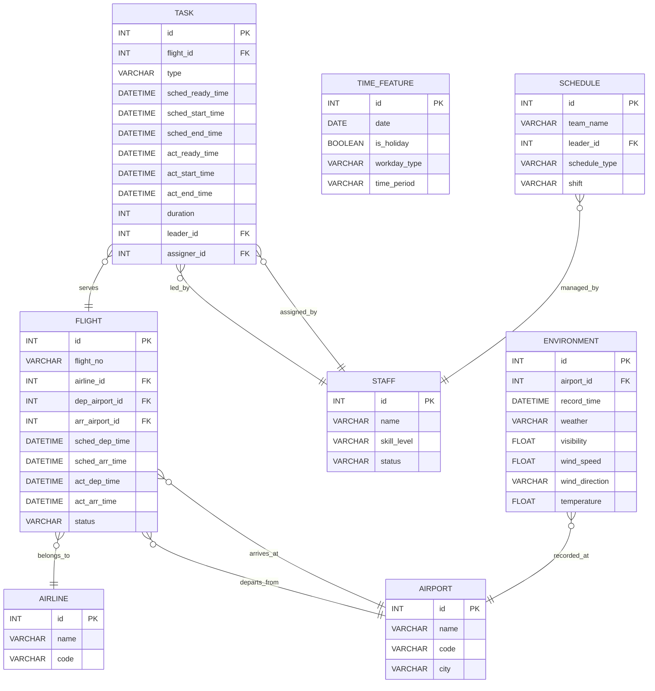
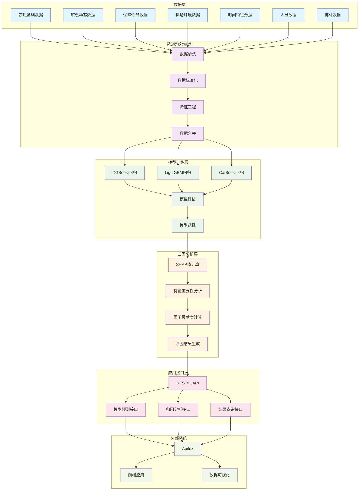

# 航班归因分析系统技术文档

## 1. 业务背景

分析航班保障任务的耗时，发现任务时长波动很大，需要通过归因分析找出波动大的原因。

## 2. 业务逻辑

### 2.1 指标选取

为了消除均值的影响，选取了变异系数(CV)作为衡量任务时长波动性大小的指标，计算公式如下：

$CV={\sigma}/{\mu}$

其中：
- σ：标准差
- μ：均值

#### 参考标准

- CV < 0.1（10%）：波动性很小，数据非常稳定
- 0.1 ≤ CV < 0.2（10%~20%）：波动性较小，数据较为稳定
- 0.2 ≤ CV < 0.3（20%~30%）：波动性中等
- CV ≥ 0.3（30%及以上）：波动性较大，数据不稳定

### 2.2 特征重要性

使用SHAP值量化各因素对CV的贡献度，包括：
- 天气条件
- 人员技能
- 时间特征
- 机场环境
- 任务类型

## 3. 数据结构

### 3.1 数据库设计



### 3.2 项目结构

```
航班归因分析/
├── 技术文档.md                    # 项目说明
├── main.py                      # 主程序入口
├── requirements.txt             # 依赖包列表
├── config.env                   # 环境配置
├── .gitignore                   # Git忽略文件
├── config/                      # 配置文件目录
│   └── 初始化.sql              # 数据库初始化脚本
├── src/                         # 源代码目录
│   ├── data/                    # 数据处理模块
│   │   ├── data_processor.py    # 主要数据处理器
│   │   └── data_visitor/        # 数据访问层
│   │       ├── base_dao.py      # 基础DAO类
│   │       ├── airline_dao.py   # 航空公司DAO
│   │       ├── airport_dao.py   # 机场DAO
│   │       ├── flight_dao.py    # 航班DAO
│   │       ├── task_dao.py      # 任务DAO
│   │       ├── staff_dao.py     # 人员DAO
│   │       ├── environment_dao.py # 环境DAO
│   │       ├── time_feature_dao.py # 时间特征DAO
│   │       ├── schedule_dao.py  # 排班DAO
│   │       └── data_service.py  # 数据服务层
│   ├── models/                  # 模型训练模块
│   │   ├── model_trainer.py     # 模型训练器
│   │   └── attribution_analyzer.py # 归因分析器
│   └── utils/                   # 工具模块
│       └── config.py            # 配置管理
├── docs/                        # 文档目录
│   ├── 技术文档.md              # 技术文档
│   ├── 数据生成器使用说明.md    # 数据生成说明
│   ├── 架构图.png               # 系统架构图
│   ├── E-R图.png                # 数据库关系图
│   └── 航班归因分析系统_API.json # API接口文档
├── plots/                       # 生成的图表目录
├── models/                      # 训练好的模型目录
└── logs/                        # 日志目录
```

## 4. 系统架构

### 4.1 架构图



## 5. 技术实现

### 5.1 技术栈

- **数据处理**：Python (pandas, numpy)
- **机器学习**：scikit-learn, xgboost, lightgbm, catboost
- **归因分析**：shap
- **API框架**：FastAPI, Flask
- **数据库**：MySQL
- **部署**：Docker, Kubernetes

### 5.2 核心模块

#### 5.2.1 数据处理模块 (data_processor.py)
- **数据获取**：通过DataService从数据库获取完整数据
- **数据清洗和标准化**：处理缺失值、异常值、重复数据
- **特征工程和编码**：
  - 时间特征提取（小时、星期、月份、是否周末）
  - 时间差值特征（起飞延误、到达延误、准备延误、开始延误、结束延误）
  - 航班状态特征工程（状态编码、是否延误、是否取消、是否提前）
  - 天气特征组合（天气严重程度）
  - 分类特征编码（航空公司、城市、任务类型、技能等级等）
- **数据预处理流程管理**：完整的7步预处理流程
- **模型训练数据准备**：特征选择、标准化、数据集划分
- **数据服务验证**：验证DataService连接和数据可用性

#### 5.2.2 数据访问层 (data_invite/)
- **BaseDAO**: 基础数据访问对象，提供通用的数据库操作方法
- **FlightDAO**: 航班数据访问对象，处理航班基础信息查询
- **AirlineDAO**: 航空公司数据访问对象，处理航空公司信息查询
- **AirportDAO**: 机场数据访问对象，处理机场信息查询
- **TaskDAO**: 任务数据访问对象，处理保障任务信息查询
- **StaffDAO**: 员工数据访问对象，处理员工信息查询
- **EnvironmentDAO**: 环境数据访问对象，处理环境信息查询
- **TimeFeatureDAO**: 时间特征数据访问对象，处理时间特征查询
- **ScheduleDAO**: 排班数据访问对象，处理排班信息查询
- **DataService**: 数据服务层，整合所有DAO，提供完整的数据获取服务

#### 5.2.3 模型训练器 (model_trainer.py)
- XGBoost、LightGBM、CatBoost三种模型
- 网格搜索超参数优化
- 模型性能评估和对比
- 自动选择最佳模型

#### 5.2.4 归因分析器 (attribution_analyzer.py)
- SHAP值计算
- 特征重要性分析
- 可视化图表生成
- 归因报告生成

#### 5.2.5 API接口 (main.py)
- 归因分析接口
- 模型训练接口
- 模型信息查询接口

### 5.3 特征工程详解

#### 5.3.1 时间特征
- **基础时间特征**：小时、星期、月份、是否周末
- **时间差值特征**：
  - `dep_delay`: 实际起飞时间与计划起飞时间的差值（分钟）
  - `arr_delay`: 实际到达时间与计划到达时间的差值（分钟）
  - `ready_delay`: 实际准备时间与计划准备时间的差值（分钟）
  - `start_delay`: 实际开始时间与计划开始时间的差值（分钟）
  - `end_delay`: 实际结束时间与计划结束时间的差值（分钟）

#### 5.3.2 航班状态特征
- **状态编码**：`status_encoded` - 将状态映射为数值（正常=1, 延误=2, 取消=3, 提前=4）
- **状态标志**：
  - `is_delayed`: 是否延误（0/1）
  - `is_cancelled`: 是否取消（0/1）
  - `is_early`: 是否提前（0/1）

#### 5.3.3 环境特征
- **天气严重程度**：`weather_severity` - 将天气条件映射为严重程度等级（晴=1, 多云=2, 雨=3, 雪=4, 雾=5）
- **数值特征**：能见度、风速、温度等

#### 5.3.4 分类特征编码
- 使用LabelEncoder对所有分类特征进行数值编码
- 包括：航空公司、出发/到达城市、任务类型、技能等级、时段、工作日类型等

#### 5.3.5 多维度CV值计算
- **计算公式**：CV = 标准差 / 平均数
- **多维度分组策略**：
  1. **航班级别CV值** (`cv_flight`)：识别异常航班
  2. **任务类型级别CV值** (`cv_task`)：识别异常任务类型
  3. **航空公司级别CV值** (`cv_airline`)：识别异常航空公司
  4. **时间维度CV值** (`cv_hour`)：识别异常时间段
- **主要目标变量**：优先使用航班级别CV值，支持细粒度波动分析
- **业务意义**：支持多维度归因分析，找出任务时长波动的具体原因

### 5.6 归因分析应用场景

#### 5.6.1 波动识别
- **异常航班识别**：通过 `cv_flight` 识别波动特别大的航班
- **异常任务类型识别**：通过 `cv_task` 识别波动特别大的任务类型
- **异常时间段识别**：通过 `cv_hour` 识别波动特别大的时间段
- **异常航空公司识别**：通过 `cv_airline` 识别波动特别大的航空公司

#### 5.6.2 归因分析流程
1. **波动检测**：识别CV值异常高的航班、任务类型、时间段等
2. **特征分析**：分析影响CV值的关键特征（天气、技能等级、设备等）
3. **根因定位**：确定导致波动的具体原因
4. **改进建议**：提出针对性的改进措施

#### 5.6.3 应用示例
```
场景：发现CA1234航班的CV值异常高（0.35）
分析步骤：
1. 检查该航班的天气条件、技能等级、设备状态等特征
2. 对比同类型航班的CV值分布
3. 识别导致波动的关键因素
4. 提出改进建议（如增加人员、改善设备等）
```

## 6. 业务流程

1. 通过DAO层从数据库获取各表原始数据
2. 使用DataService整合和合并所有相关数据
3. 通过DataProcessor对数据进行清洗及标准化，划分训练集和测试集
4. 分别使用XGBoost回归、LightGBM回归、CatBoost回归进行模型拟合，评估模型拟合情况，选择拟合效果最好的模型
5. 利用训练集训练归因模型，方法使用SHAP值
6. 使用测试集对归因分析模型进行测试，评估分析模型准确度
7. 导出成接口，上传到Apifox

## 7. 功能特性

- **多模型支持**：XGBoost、LightGBM、CatBoost
- **归因分析**：基于SHAP值的特征贡献度分析
- **RESTful API**：完整的API接口
- **数据预处理**：自动化的数据清洗和特征工程
- **模型评估**：多指标模型性能评估
- **可视化**：SHAP图表和特征重要性图


## 8. API接口文档

### 8.1 API文档访问

访问 `http://localhost:8000/docs` 查看交互式API文档

### 8.2 主要API接口

#### 8.2.1 归因分析
```bash
POST /api/v1/attribution
Content-Type: application/json

{
  "flight_data": {
    "airline_id": 1,
    "weather": "雨",
    "temperature": 15.0,
    ...
  }
```

#### 8.2.2 训练模型
```bash
POST /api/v1/train
```

#### 8.2.3 获取模型信息
```bash
GET /api/v1/model/info
```

## 9. 模型说明

### 9.1 变异系数（CV）
- **标准定义**：CV = 标准差 / 平均数
- **计算公式**：`CV = σ/μ`
  - σ：标准差
  - μ：均值
- **分组计算**：按航班号、任务类型等维度分组，计算每组内duration的CV值
- **异常处理**：对于无穷大或NaN值，使用默认CV值0.2

### 9.2 波动性级别
- CV < 0.1：波动性很小
- 0.1 ≤ CV < 0.2：波动性较小
- 0.2 ≤ CV < 0.3：波动性中等
- CV ≥ 0.3：波动性较大

### 9.3 模型评估指标
- **MSE**：均方误差
- **RMSE**：均方根误差
- **MAE**：平均绝对误差
- **R²**：决定系数


